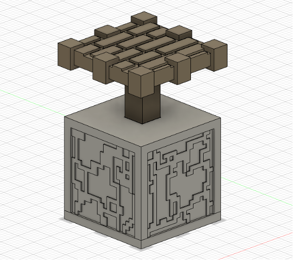
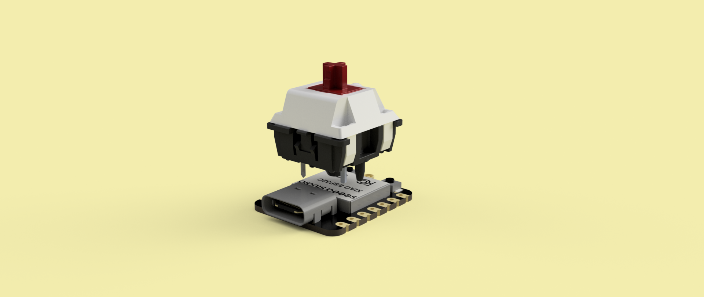

# Pistenter

Alguna vez te haz preguntado: "Que pasaria si pudiera utilizar redstone y pistones de Minecraft en la vida real?" PORQUE YO SI! desafortunadamente les debo la redstone, pero les presento **PISTENTER** una ingeniosa combinacion entre "Piston" y "Enter" y eso es todo lo que hace, presionas el piston y su mecanismo de redstone interior (Osea su XIAO p2024 conectada a un swcht mmm) envia una señal a tu pc que le dice "Holaaa, soy pistenter, me acaban de tocar osea que debes reaccionar al enter"

# CAD:

# Look interior:

**Hardware**
-Switch
-Cerebro
-Resistencia

Mi motivacion para construir esto fue que queria un teclado de una tecla, pero todos eran aburridos, feos y excesivamente caros, asi que decidi fabricar el mio, mas bonito y facil de reparar.
